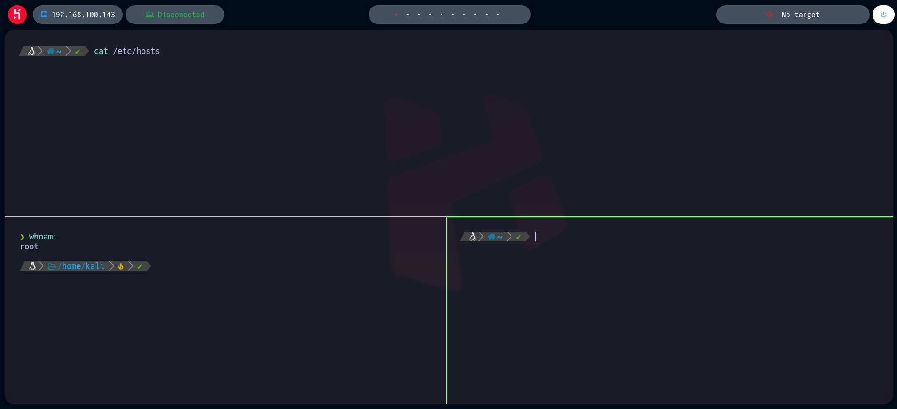

# Auto Configure Bspwm

[](https://github.com/danielguaycha)
[](https://github.com/danielguaycha) 
[](https://github.com/danielguaycha) 


Comandos que permiten configurar automáticamente el bspwn y diversas herramientas en entornos Linux: Parrot & Kali, inspirado en la configuración trabajada por [S4vitar](https://github.com/s4vitar) en la académia [Hack4u](https://hack4u.io/).




## Instalación

```bash
git clone https://github.com/danielguaycha/auto-configure-bspwn
cd auto-configure-bspwn/
python3 main.py
```
**Importante:** Sigue los pasos que el script muestra en pantalla.

## Requierimientos

- Kali Linux
- ParrotOS
- Python

## Listado de herramientas instaladas

- bspwm: Gestor de ventanas de Linux
- zsh: Shell
- powerlevel10k: Tema para Zsh
- sxhkd: Gestor de comandos y eventos de teclado
- polybar: Herramienta para crear la header bar
- rofi: Selector de aplicaciones dinámico
- feh: Visor de imágenes
- fzf: Buscador de línea de comandos
- Nvim: Editor de texto custom

## ⌨️ Atajos de teclado
<kbd>Windows</kbd> + <kbd>Enter</kbd> : Abrir la consola (gnome-terminal).  
<kbd>Windows</kbd> + <kbd>W</kbd> : Cerrar la ventana actual.  
<kbd>Windows</kbd> + <kbd>Alt</kbd> + <kbd>R</kbd> : Reiniciar la configuración del bspwm.  
<kbd>Windows</kbd> + <kbd>Alt</kbd> + <kbd>Q</kbd> : Cerrar sesión.  
<kbd>Windows</kbd> + <kbd>(⬆⬅⬇➡)</kbd> : Moverse por las ventanas en la workspace actual.  
<kbd>Windows</kbd> + <kbd>D</kbd> : Abrir el Rofi. <kbd>Esc</kbd> para salir.  
<kbd>Windows</kbd> + <kbd>(1,2,3,4,5,6,7,8,9,0)</kbd> : Cambiar el workspace.  
<kbd>Windows</kbd> + <kbd>T</kbd> : Cambiar la ventana actual a modo "terminal" (normal). Nos sirve cuando la ventana está en modo pantalla completa o flotante.  
<kbd>Windows</kbd> + <kbd>M</kbd> : Cambiar la ventana actual a modo "completo" (no ocupa la polybar). Presione la mismas teclas para volver a modo "terminal" (normal).  
<kbd>Windows</kbd> + <kbd>F</kbd> : Cambiar la ventana actual a modo pantalla completa (ocupa todo incluyendo la polybar).  
<kbd>Windows</kbd> + <kbd>S</kbd> : Cambiar la ventana actual a modo "flotante".  
<kbd>Windows</kbd> + <kbd>Alt</kbd> + <kbd>(1,2,3,4,5,6,7,8,9,0)</kbd> : Mover la ventana actual a otro workspace.  
<kbd>Windows</kbd> + <kbd>Alt</kbd> + <kbd>(⬆⬅⬇➡)</kbd> : Cambiar el tamaño de la ventana actual (solo funciona si está en modo terminal o flotante).  
<kbd>Windows</kbd> + <kbd>Ctrl</kbd> + <kbd>(⬆⬅⬇➡)</kbd> : Cambiar la posición de la ventana actual (solo funciona en modo flotante).  
<kbd>Windows</kbd> + <kbd>Shift</kbd> + <kbd>G</kbd> : Abrir Google Chrome (es necesario instalarlo primero).  
<kbd>Windows</kbd> + <kbd>Ctrl</kbd> + <kbd>Alt</kbd> + <kbd>(⬆⬅⬇➡)</kbd> : Mostrar una preselección para luego abrir una ventana (una terminal, Google Chrome, un archivo, etc.). <kbd>Windows</kbd> + <kbd>Ctrl</kbd> + <kbd>Space</kbd> para deshacer la preselección.  

## Créditos
- [S4vitar](https://github.com/s4vitar)
- [Hack4u](https://hack4u.io/)

# Contribuciones

Si deseas colaborar con la mejora del script son bienvenidos los PRs 😎. Si te ha servido, tienes dudas o algun reporte, dejamelo saber en TW o Linkedin.

<p align="center">

[](https://x.com/danielguaycha)
[](https://www.linkedin.com/in/danielguaycha)

</p>